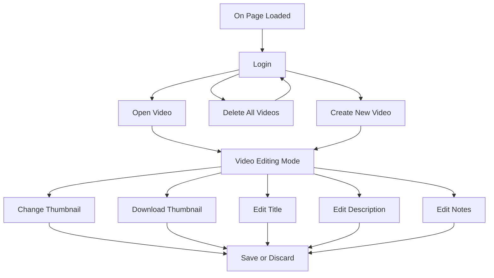

# [YouTube Video Planner](https://chezyname.github.io/YouTubePlanner/)

➤ [Changelog](#changelog)

## How To Plan Your Videos

Once you open the webpage and login to google.

> Google is needed for YouTube API and Google Drive API.

> YouTube API is used to display the user's subscriber count, views, and video count

>Google Drive API is used to hold and store all the files

  

You can press the ***Create New Video*** Button to create a new video.


  

Once this button is pressed, you be greated with a new page where you can edit the entire video plan.

  


On this page, you can upload and download your thumbnails as well as editing the title, description, and user generated notes.

## How This Website Works

On this website, all your data is held by Google / Google Drive.

  



  

Heres an example of how the page works.

  

## How To Update My Own

When you fork or clone this repository, your website will not be able to use Google Authentication unless you add your own Google Auth from [Google Developer Portal](https://console.cloud.google.com/).  Once loged in, you must setup the OAuth Screen.

### OAuth
Setting up the OAuth is easy, you just have to define what the app does and what scopes you will be using. The scopes use are

- Google Drive API - `./auth/drive.aoodata`
- Google Drive API - `./auth/drive.fille`
- YouTube Data API v3 - `./auth/youtube/readonly`

After you have enabled all these scopes, under the ***Credentials*** tab, Create a new API key and a new OAuth Client ID for Web application. make sure you put your website link as ***Authorized JavaScript origins*** and ***Authorized redirect URIs***.

With your **API KEY** and your **OAuth Client ID**
replace client ID and API key inside src/main.jsx
like so:

```
import  React  from  'react'

import  ReactDOM  from  'react-dom/client'

import  App  from  './App.jsx'

import  './index.css'

import { GoogleOAuthProvider } from  '@react-oauth/google';

  

ReactDOM.createRoot(document.getElementById('root')).render(

<React.StrictMode>

<GoogleOAuthProvider  clientId="CLIENT_ID">

<App  clientID="CLIENT ID"

APIKey="API KEY"/>

</GoogleOAuthProvider>

</React.StrictMode>,

)
```

# Changelog
[11/1/23] - Added The Full Support Of .PSD `Photoshop Files` As Thumbnails In The Grid Layout, Including Downloading and Uploading .PSD Files!

# Upcomming Changes
Future planning where you are able to set the date the video you plan would come out
You can also see each video plans based on year