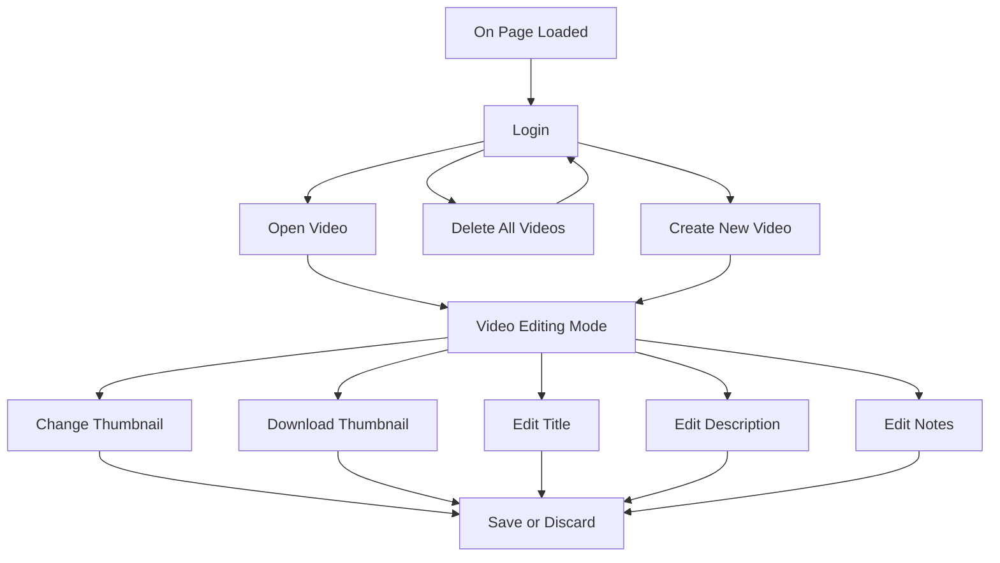

# [YouTube Video Planner](https://chezyname.github.io/YouTubePlanner/)

## How To Plan Your Videos
Once you open the webpage and login to google.
> Google is needed for YouTube API and Google Drive API.
> YouTube API is used to display the user's subscriber count, views, and video count
>Google Drive API is used to hold and store all the files

You can press the ***Create New Video*** Button to create a new video.

Once this button is pressed, you be greated with a new page where you can edit the entire video plan.

 On this page, you can upload and download your thumbnails as well as editing the title, description, and user generated notes.
 
## How This Website Works
On this website, all your data is held by Google / Google Drive. 

Heres an example of how the page works.